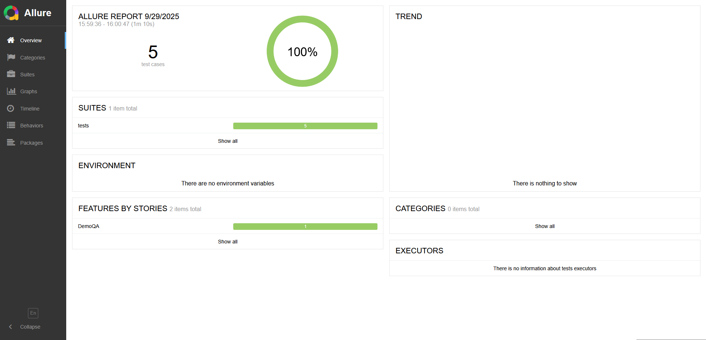
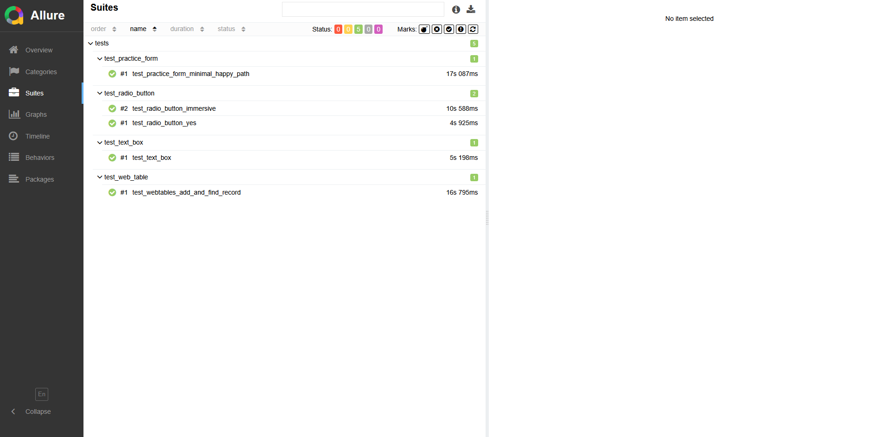

# 🧪 Selenium UI Tests for DemoQA

Учебный pet-проект: автотесты на **Python + Selenium + Pytest** в архитектуре **Page Object Model (POM)** с отчётностью **Allure**. Покрывает ключевые сценарии сайта [demoqa.com](https://demoqa.com) и демонстрирует базовые навыки UI-автоматизации: ожидания, работа с формами, таблицами, радиокнопками, вложения при падениях.

---

## 🚀 Технологии

* Python 3.12
* Pytest
* Selenium WebDriver + webdriver-manager
* Allure Pytest (шаги, метки, вложения)
* Pytest-xdist (параллельный запуск)
* Jenkins CI/CD (опционально)

---

## ⚙️ Быстрый старт

**1) Клонировать репозиторий**

```bash
git clone https://github.com/username/python-selenium.git
cd python-selenium
```

**2) Виртуальное окружение**

```bash
python -m venv .venv
# Windows
.venv\Scripts\activate
# Linux/Mac
source .venv/bin/activate
```

**3) Установить зависимости**

```bash
pip install -r requirements.txt
```

**4) Запустить тесты**

```bash
pytest
```

**5) Allure-отчёт**

```bash
# собрать результаты
pytest --alluredir=allure-results
# интерактивный отчёт
allure serve allure-results
# статический отчёт в папку allure-report
allure generate allure-results -o allure-report --clean
```

> Примечание (Windows): удобнее установить Allure CLI через `scoop install allure` или `choco install allure`.

---

## ✅ Покрытие тестами (позитивные сценарии)

* **Elements**

  * Text Box — заполнение и проверка результата
  * Radio Button — выбор Yes/Impressive и валидация текста
  * Web Tables — добавление записи, поиск по e-mail
* **Forms**

  * Practice Form — минимально валидное заполнение, submit и проверка модального результата

---

## 🛠️ Особенности реализации

* **POM**: весь Selenium-код инкапсулирован в классах страниц; тесты читаются как сценарии.
* **Ожидания**: везде используются `WebDriverWait + expected_conditions` (без `time.sleep`).
* **Вложения в Allure при падениях**: скриншот и `page_source` подключаются автоматически из `conftest.py`.
* **Метки и шаги**: поддержка `@allure.epic/feature/story/severity` и `allure.step(...)` для читабельного отчёта.
* **Параллель**: поддержка `pytest -n auto` через `pytest-xdist`.

---

## 🖼️ Примеры Allure отчётов

*Allure summary:*



*Шаги и вложения:*



---

## 🔧 Полезные команды

**Параллельный запуск:**

```bash
pytest -n auto
```

**Запуск по меткам (пример):**

```bash
pytest -m "ui" --alluredir=allure-results
```

**Очистить кеш pytest:**

```bash
pytest --cache-clear
```

---

## 🏗️ CI/CD (дальше подключается Jenkins)

* Генерируйте результаты `--alluredir=allure-results`.
* В Jenkins установите **Allure Jenkins Plugin** и укажите путь к результатам.
* Для трендов храните `allure-report/history/` между билдами.
* (Опционально) добавьте `Jenkinsfile` с шагами: checkout → venv → install → pytest → публикация Allure.

---

## 🧭 Дальнейшие шаги

* Параметризация тестов и негативные кейсы (валидация e-mail и др.).
* Расширение покрытия Forms (Subjects/Hobbies, Date of Birth, Upload, State/City).
* Матрица браузеров (Chrome/Firefox) и headless-запуски.
* Уведомления о результатах (Telegram/Slack).

---

## 📜 Лицензия

Свободное использование в образовательных целях.
